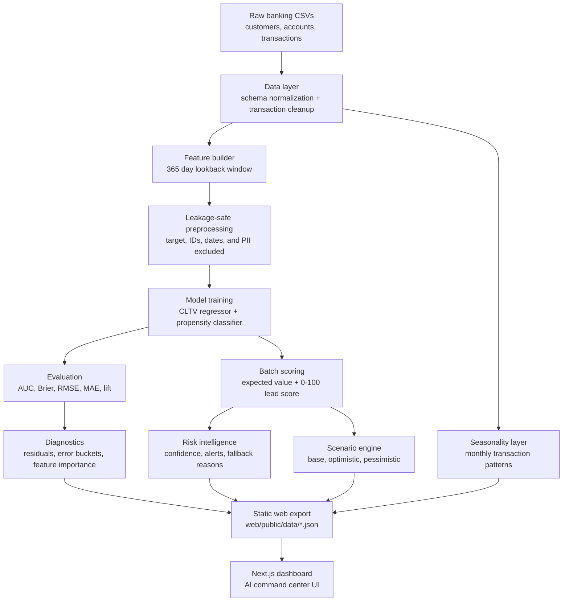

# Bank Lead Scoring Intelligence Platform

An end-to-end customer intelligence system for banking lead prioritization. The project combines transactional behavior, account metadata, customer profile attributes, CLTV modeling, propensity scoring, risk rules, residual diagnostics, scenario simulation, and a modern static-data Next.js dashboard.

This is built as a portfolio-grade AI/ML analytics product rather than a notebook-only model experiment. Python owns the data science and model pipeline; the frontend consumes stable JSON exports.

## Problem Statement

Retail and SME banking teams often need to answer:

- Which customers should relationship managers prioritize?
- Which customers have high expected value but also high outreach risk?
- How reliable are the model scores?
- What product opportunities and portfolio scenarios should be surfaced to business users?

This project turns raw customer, account, and transaction data into a ranked lead intelligence layer with model evaluation and product-style dashboarding.

## Core Capabilities

- Historical snapshot based feature generation to prevent target leakage.
- Separate CLTV and propensity models.
- Expected value scoring: `predicted_cltv * predicted_propensity`.
- 0-100 percentile lead score with Hot / Medium / Cold categories.
- Model registry and model comparison leaderboard.
- Residual diagnostics and error distribution.
- Risk scoring and alert rules for outreach quality.
- Scenario analysis for optimistic, base, and pessimistic portfolio value.
- Seasonality and transaction trend summaries.
- Static JSON export layer for web dashboards.
- Modern Next.js dashboard with TypeScript, Tailwind, Recharts, Framer Motion, and Lucide icons.
- Legacy Streamlit dashboard retained as a fallback.

## Architecture



## Pipeline Flow

```text
Raw Data
  -> Data Loader
  -> Validation and Schema Normalization
  -> Customer Feature Engineering
  -> Historical Train/Test Split
  -> CLTV + Propensity Training
  -> Model Evaluation and Comparison
  -> Batch Lead Scoring
  -> Diagnostics, Risk, Scenario, Seasonality
  -> Static JSON Export
  -> Next.js Dashboard
```

## Project Structure

```text
.
  app/                      Legacy Streamlit dashboard
  configs/                  Project, model, dashboard, and scenario config
  data/raw/                 Source customer, account, and transaction CSVs
  data/processed/           Feature tables, model matrices, and lead scores
  docs/                     Architecture, methodology, installation, results notes
  models/                   Trained model artifacts and metadata
  reports/figures/          Calibration and importance figures
  reports/tables/           Metrics, diagnostics, risks, scenarios, exports
  scripts/                  Pipeline, audit, health check, and export entrypoints
  src/lead_scoring/         Reusable Python ML package
  tests/                    Backend contract, metrics, comparison, export tests
  web/                      Next.js dashboard consuming static JSON exports
```

## Backend Modules

| Module | Responsibility |
| --- | --- |
| `src/lead_scoring/data.py` | Raw table loading, transaction cleaning, account aggregation, target creation |
| `src/lead_scoring/features.py` | Leakage-safe preprocessing and train/test/scoring matrix creation |
| `src/lead_scoring/training.py` | CLTV and propensity model training |
| `src/lead_scoring/evaluation.py` | Test-set metrics, calibration, decile lift, predictions |
| `src/lead_scoring/model_registry.py` | Model metadata registry for docs and dashboard |
| `src/lead_scoring/model_comparison.py` | Business-oriented model/baseline leaderboard |
| `src/lead_scoring/diagnostics.py` | Residual records, error buckets, diagnostic summary |
| `src/lead_scoring/risk.py` | Risk score, confidence score, and outreach alerts |
| `src/lead_scoring/scenario.py` | Portfolio expected-value scenario simulation |
| `src/lead_scoring/seasonality.py` | Monthly transaction trend and seasonality artifacts |
| `src/lead_scoring/web_export.py` | Stable JSON contracts for Next.js |

## Leakage Prevention

The pipeline explicitly excludes target, identifier, date, and direct PII fields from model matrices:

```text
future_revenue_12m
converted_12m
customer_id
first_name / last_name
email / phone
dob / postal_code
first_txn / last_txn
date_of_lead / snapshot_date
```

Training uses a historical snapshot:

```text
training snapshot = max_transaction_date - 365 days
target window     = next 365 days after snapshot
current scoring   = latest available transaction snapshot
```

This prevents the previous failure mode where the model saw target information or attached shuffled predictions to the wrong customer IDs.

## Model and Scoring Design

The scoring system has three core layers:

1. **CLTV Model**
   Predicts 12 month transaction value.

2. **Propensity Model**
   Predicts probability of future positive activity.

3. **Expected Value Ranker**
   Combines value and propensity:

```text
expected_value = predicted_cltv * predicted_propensity
lead_score     = percentile_rank(expected_value) * 100
```

Lead categories:

```text
Hot    >= 70
Medium 30-69
Cold   < 30
```

## Current Results

Latest rebuilt artifacts:

| Metric | Value |
| --- | ---: |
| Scored customers | 500 |
| Feature columns | 29 |
| Test rows | 100 |
| Test positive rate | 66.0% |
| Propensity AUC | 0.913 |
| Propensity Brier score | 0.126 |
| CLTV RMSE | INR 145,270 |
| CLTV MAE | INR 82,076 |

Lead distribution:

| Category | Customers |
| --- | ---: |
| Hot | 153 |
| Medium | 200 |
| Cold | 147 |

## Product Intelligence Artifacts

Key generated files:

```text
reports/tables/metrics_summary.csv
reports/tables/model_comparison.csv
reports/tables/decile_lift.csv
reports/tables/residual_diagnostics.csv
reports/tables/risk_signals.csv
reports/tables/scenario_forecasts.csv
reports/tables/seasonality_monthly.csv
reports/tables/feature_importance.csv
web/public/data/*.json
```

Frontend JSON contracts:

```text
web/public/data/overview.json
web/public/data/forecast.json
web/public/data/models.json
web/public/data/diagnostics.json
web/public/data/risks.json
web/public/data/seasonality.json
web/public/data/scenarios.json
web/public/data/methodology.json
```

## Dashboard

The primary dashboard is a Next.js app in `web/`.

Pages:

- Overview
- Forecast
- Models
- Risk
- Diagnostics
- Seasonality
- Scenario
- Methodology

Tech stack:

```text
Next.js App Router
TypeScript
Tailwind CSS
Recharts
Framer Motion
Lucide React
Static JSON data contracts
```

The legacy Streamlit dashboard remains in `app/streamlit_app.py`.

## Quick Start

```bash
python3 -m venv .venv
source .venv/bin/activate
pip install -r requirements.txt

python scripts/run_pipeline.py
python scripts/run_export_web_data.py
python scripts/repo_health_check.py
python -m pytest -q

cd web
npm install
npm run dev
```

Open:

```text
http://localhost:3000
```

If port `3000` is busy:

```bash
npm run dev -- --port 3001
```

## Makefile Commands

```bash
make train       # run full backend pipeline
make export-web  # export dashboard JSON files
make health      # verify artifact contracts
make test        # run backend tests
make dashboard   # launch legacy Streamlit dashboard
```

## Verification

Commands verified during the latest upgrade:

```bash
python3 -m compileall src scripts tests
pytest -q
python3 -m scripts.run_project_audit
python3 -m scripts.run_export_web_data
python3 scripts/repo_health_check.py
cd web && npm run lint
cd web && npm run build
```

Status:

```text
Backend tests: 9 passed
Health check: passed
Next.js lint: passed
Next.js production build: passed
```

## Dashboard Preview

Screenshots can be added after local visual review:

```text
reports/figures/dashboard_overview.png
reports/figures/dashboard_models.png
reports/figures/dashboard_risk.png
```

## Limitations

- The dataset is synthetic and small.
- Metrics are prototype validation, not production proof.
- Scenario outputs are static simulations, not live causal forecasts.
- The model leaderboard includes baselines and a production ranker; adding more independently trained model families would make comparison stronger.

## Future Improvements

- Add more trained model candidates such as calibrated random forest, XGBoost, and logistic/ridge baselines.
- Add drift monitoring and data-quality trend reports.
- Add automated screenshot capture for dashboard documentation.
- Deploy the Next.js dashboard.
- Add CI checks for Python tests, web build, and JSON schema contracts.
